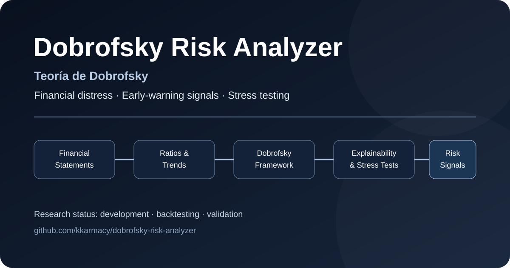

# Dobrofsky Risk Analyzer

**Teoría de Dobrofsky · Financial distress · Early-warning signals · Stress testing · Explainable risk analytics**

<p align="center">
  
</p>

[](https://react.dev/)
[](https://vite.dev/)
[](https://nodejs.org/)
[](#roadmap)

## 📍 Project Status

**Active research — development, backtesting and validation.**

This project is not presented as an independently validated predictive model. Its methodology and performance are being documented and tested.

---

Dobrofsky Risk Analyzer is the experimental software implementation of the **Dobrofsky Theory (Teoría de Dobrofsky)**, a financial-risk research framework developed by **Christian Dobrofsky**.

The theory explores whether a structured combination of **financial statement normalization, financial ratios, scoring logic, explainability, stress testing, historical analysis and benchmarking** can provide more useful early-warning signals for corporate financial deterioration.

The project is intended as a decision-support and research tool for analysts, finance professionals, credit teams and researchers interested in corporate financial distress and early-warning frameworks. The Dobrofsky Theory is currently **under development, testing, backtesting and validation**; it should not be treated as an established or independently validated predictive model.

---


## 🖼 Analytical Flow


The analyzer is designed as a layered decision-support system rather than a single black-box score. Each stage can be tested, explained and improved independently.

---

## 🧠 Teoría de Dobrofsky

📄 **Formal research document:** [docs/DOBROFSKY_THEORY.md](docs/DOBROFSKY_THEORY.md)

The **Dobrofsky Theory** is the conceptual framework behind this repository. Its objective is to study financial deterioration as a **multi-factor and dynamic process**, rather than relying on a single isolated ratio or one-period score.

The working hypothesis is that risk assessment may become more informative when it combines:

- normalized financial-statement inputs
- liquidity, leverage, profitability, coverage and efficiency ratios
- trend deterioration across periods
- early-warning indicators
- stress and sensitivity scenarios
- explainable decomposition of risk drivers
- benchmarking against established financial-distress models

This repository is being used to translate that theory into testable software components and to evaluate the framework through documented backtesting and comparison.

---

## 🎯 Project Goals

The project is being developed around five principles:

1. **Transparent inputs** — financial statement data should be normalized and validated before scoring.
2. **Explainable outputs** — risk results should show the drivers behind the result, not only a final score.
3. **Scenario awareness** — stress tests and sensitivity analysis should show how risk changes under adverse assumptions.
4. **Historical context** — trend analysis matters as much as a single-period snapshot.
5. **Model validation** — predictive claims should only follow documented backtesting and benchmarking.

---

## 🔍 Core Analytical Areas

| Area | Purpose |
|---|---|
| Financial Statement Normalization | Prepare consistent financial inputs before analysis |
| Financial Ratios | Measure liquidity, leverage, profitability, coverage and efficiency |
| Dobrofsky Scoring Engine | Apply the project's independent scoring methodology |
| Explainability | Identify which variables contribute most to the risk result |
| Historical Risk Analysis | Track changes in financial condition through time |
| Early-Warning Signals | Surface deteriorating indicators before they become critical |
| Stress Testing | Recalculate risk under adverse financial scenarios |
| Sensitivity Analysis | Measure how key assumptions affect outputs |
| Benchmarking | Compare results against established distress models |

---

## 🧱 Architecture

The codebase is intentionally separated into analytical layers so that scoring logic, stress testing and historical analysis can evolve independently.

Key areas include:

- `src/` — application and analytical engine
- `src/engine/` — model and risk logic
- `test/` — automated tests
- `docs/` — supporting documentation
- `index.html` — application entry point

---

## 🛠 Technology

- **React 19**
- **Vite 7**
- **Recharts**
- **Node.js 24+**
- Native Node test runner

---

## 🚀 Local Development

```bash
npm install
npm run dev
```

Production build:

```bash
npm run build
```

Run tests:

```bash
npm test
```

Run syntax/model checks:

```bash
npm run check
```

---

## 🗺 Roadmap

- [x] Project architecture and analytical separation
- [ ] Financial statement normalization and validation
- [ ] Independent Dobrofsky scoring engine
- [ ] Risk decomposition and explainability
- [ ] Historical risk evolution and early-warning indicators
- [ ] Stress testing and sensitivity analysis
- [ ] Backtesting and benchmarking against established distress models
- [ ] Expanded web application
- [ ] API layer
- [ ] Documented validation dataset and methodology

---

## 🤝 Contributions & Feedback

Feedback from professionals in **credit risk, corporate finance, financial analysis, banking and model validation** is especially valuable.

If you test the project, suggestions on the following are welcome:

- Model assumptions
- Ratio selection
- Stress scenarios
- Explainability
- Benchmarking methodology
- User experience
- Validation design

Issues and pull requests are welcome.

---

## ⚠️ Important Disclaimer

Dobrofsky Risk Analyzer is a **research and analytical decision-support project**.

Risk outputs are analytical estimates and **do not guarantee default, bankruptcy, solvency, investment performance or future outcomes**. They should not be treated as a substitute for professional credit analysis, audited financial information, investment advice or independent due diligence.

Model validation and documented backtesting are required before predictive claims are made.

---

## 🔗 Related Projects

- **Declarafy:** [github.com/kkarmacy/declarafy](https://github.com/kkarmacy/declarafy) — TaxTech con IA para el mercado peruano
- **Christian Dobrofsky:** [github.com/kkarmacy](https://github.com/kkarmacy) — perfil y proyectos

---

## 👤 Author

**Christian Dobrofsky**  
Financial Consultant · Corporate Finance · Risk Analytics · AI

GitHub: [@kkarmacy](https://github.com/kkarmacy)
