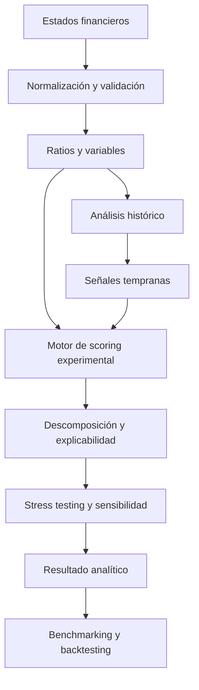

# Teoría de Dobrofsky

> **Estado:** marco conceptual en investigación, desarrollo, backtesting y validación.  
> **Autor:** Christian Dobrofsky  
> **Implementación experimental:** [Dobrofsky Risk Analyzer](https://github.com/kkarmacy/dobrofsky-risk-analyzer)

## 1. Propósito

La **Teoría de Dobrofsky** es un marco de investigación para analizar el deterioro financiero empresarial como un proceso **multifactorial, dinámico y explicable**.

Su objetivo no es sustituir modelos establecidos ni afirmar capacidad predictiva no demostrada. El proyecto busca estudiar si la combinación estructurada de información financiera, tendencias históricas, señales tempranas y escenarios de estrés puede producir una lectura de riesgo más útil que la observación aislada de un único ratio o de un único periodo.

## 2. Hipótesis de trabajo

La hipótesis central es que el riesgo de deterioro financiero puede evaluarse de manera más informativa cuando se integran, de forma documentada y trazable:

- normalización y validación de estados financieros;
- ratios de liquidez;
- apalancamiento y estructura de capital;
- rentabilidad;
- cobertura y capacidad de servicio de deuda;
- eficiencia operativa;
- evolución histórica de los indicadores;
- señales de deterioro temprano;
- stress testing y análisis de sensibilidad;
- explicación de los principales impulsores del resultado;
- comparación contra modelos de distress financiero ya establecidos.

La hipótesis deberá someterse a pruebas empíricas antes de formular conclusiones predictivas.

## 3. Principios metodológicos

### Transparencia de inputs
Los datos deben ser normalizados y validados antes de ingresar al motor analítico.

### Enfoque multifactorial
Ningún indicador individual debe interpretarse como evidencia suficiente de deterioro financiero.

### Dimensión temporal
La dirección y velocidad del cambio de los indicadores pueden ser tan importantes como su nivel absoluto.

### Explicabilidad
El resultado debe permitir identificar qué factores contribuyen al nivel de riesgo observado.

### Sensibilidad a escenarios
El análisis debe poder mostrar cómo cambia el perfil de riesgo ante supuestos adversos.

### Validación externa
La metodología deberá contrastarse con modelos establecidos y con datos históricos fuera de muestra cuando sea posible.

## 4. Familias de variables

La investigación puede incorporar variables agrupadas en las siguientes familias:

| Familia | Ejemplos |
|---|---|
| Liquidez | razón corriente, prueba ácida, capital de trabajo |
| Apalancamiento | deuda/activos, deuda/patrimonio, deuda/EBITDA |
| Rentabilidad | margen operativo, ROA, ROE |
| Cobertura | cobertura de intereses, capacidad de servicio de deuda |
| Eficiencia | rotación de activos, inventarios y cuentas por cobrar |
| Flujo de caja | generación operativa, conversión de EBITDA a caja |
| Tendencia | deterioro/mejora de métricas entre periodos |
| Estrés | sensibilidad a ventas, márgenes, tasas y deuda |
| Señales tempranas | cambios persistentes y combinaciones de alertas |

La inclusión, ponderación y transformación final de variables debe justificarse mediante pruebas y documentación.

## 5. Arquitectura conceptual

## 6. Diferenciación frente a modelos establecidos

La Teoría de Dobrofsky debe evaluarse frente a referencias reconocidas, no presentarse como superior por definición.

El proceso de benchmarking puede incluir, según disponibilidad de datos y pertinencia:

- Altman Z-Score y variantes;
- modelos logit/probit de distress;
- scoring financiero basado en ratios;
- enfoques de machine learning explicable;
- métricas internas de crédito cuando existan datos comparables.

Toda comparación deberá documentar población, periodo, definición de distress, métricas de desempeño y limitaciones.

## 7. Propuesta de validación

Una validación rigurosa debería incluir:

1. definición operativa de "distress";
2. selección de una muestra histórica;
3. separación entre entrenamiento/calibración y prueba fuera de muestra;
4. tratamiento de valores faltantes y outliers;
5. backtesting por periodos;
6. sensibilidad por sector y tamaño de empresa;
7. comparación con benchmarks;
8. métricas como precisión, recall, ROC-AUC u otras apropiadas;
9. pruebas de estabilidad;
10. documentación de falsos positivos y falsos negativos.

## 8. Limitaciones actuales

Actualmente la teoría y su implementación se encuentran en investigación y desarrollo. Entre las principales limitaciones se incluyen:

- ausencia de validación independiente;
- necesidad de ampliar datasets históricos;
- posible sensibilidad a calidad contable y disponibilidad de datos;
- necesidad de evaluar diferencias sectoriales;
- necesidad de definir y calibrar umbrales;
- riesgo de sobreajuste si se usan demasiadas variables con muestras pequeñas;
- necesidad de pruebas fuera de muestra antes de realizar afirmaciones predictivas.

## 9. Principios de uso responsable

Los resultados deben tratarse como apoyo analítico y no como una garantía de solvencia, insolvencia, default, quiebra o rendimiento futuro.

La metodología no sustituye:

- estados financieros auditados;
- due diligence;
- análisis crediticio profesional;
- opinión legal, contable o de inversión;
- criterios regulatorios o políticas internas de una entidad financiera.

## 10. Agenda de investigación

Las siguientes líneas forman parte de la agenda de desarrollo:

- formalización matemática del score;
- selección y estabilidad de variables;
- calibración de ponderaciones;
- análisis sectorial;
- detección de deterioro temprano;
- stress testing;
- explicabilidad;
- benchmarking;
- backtesting;
- pruebas fuera de muestra;
- publicación de metodología y resultados reproducibles.

## 11. Implementación

El repositorio **Dobrofsky Risk Analyzer** es la implementación experimental utilizada para convertir estos conceptos en módulos de software probables, medibles y comparables.

Repositorio: https://github.com/kkarmacy/dobrofsky-risk-analyzer

---

**Nota:** este documento describe un marco de investigación en evolución. Cualquier afirmación de capacidad predictiva deberá estar respaldada por evidencia empírica, metodología reproducible y validación documentada.
